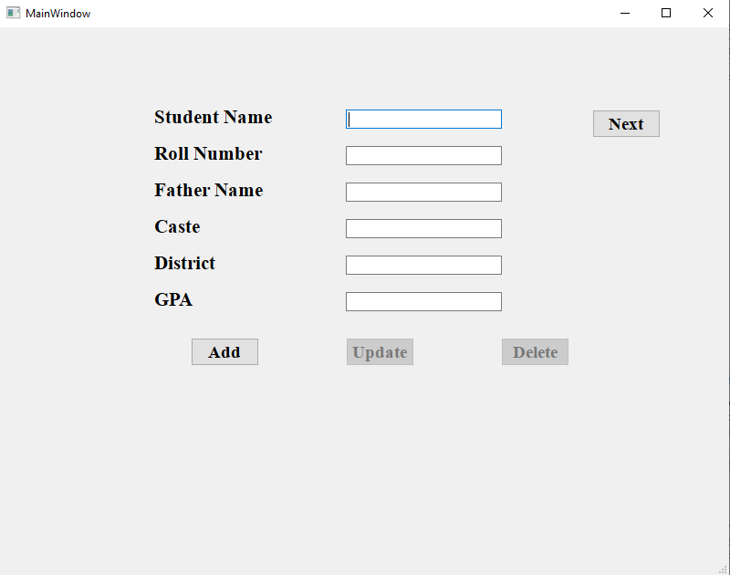

# 🎓 Student Management Record - Final Project

A **Qt-based desktop application** to manage student records with ease.  
Built as a **final semester project**, demonstrating **C++ programming, Qt GUI development, and basic data management**.  

[](https://github.com/K25SW01/StudentManagementRecord-FinalProject)

---

## ✨ Features

- 📝 **Add Students** – Quickly add new student records  
- ✏️ **Edit Records** – Update student details anytime  
- ❌ **Delete Records** – Remove unwanted entries  
- 📊 **View All** – Display all student data in a neat table  
- 🖥️ **Intuitive GUI** – Simple and user-friendly interface  
- 💾 **Local Storage** – Data saved locally, extendable to a database  

---

## 🖼️ Screenshots

*(Optional: Add your screenshots here for visual appeal)*  

  
  

> Tip: Create a `screenshots` folder in your project root and save images there.

---

## 🚀 Installation

### Prerequisites

- **Qt 5.x or 6.x** (Qt Creator IDE recommended)  
- **C++ compiler** (MSVC, MinGW, or GCC)  
- **Git** (for cloning the repo)  

### Steps

1. Clone the repository:

```bash
git clone https://github.com/K25SW01/StudentManagementRecord-FinalProject.git
